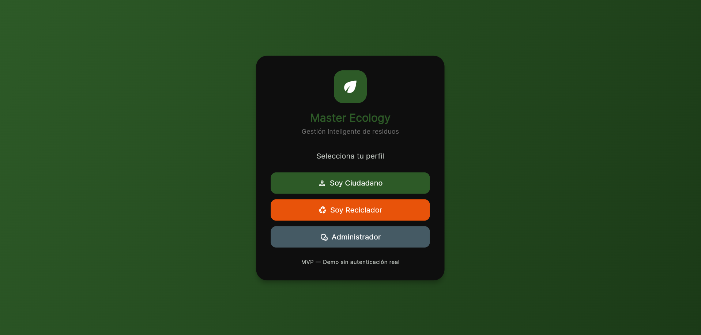
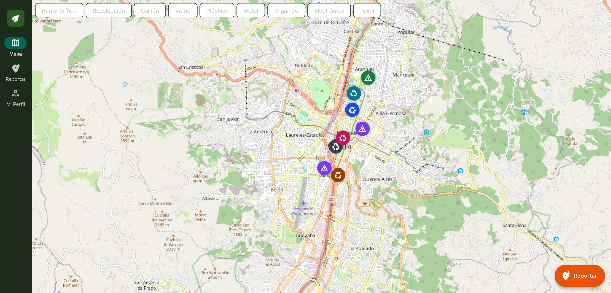
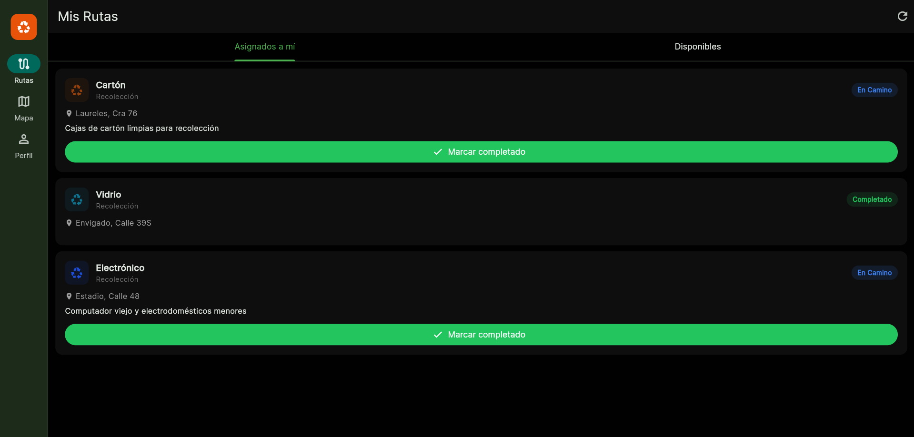
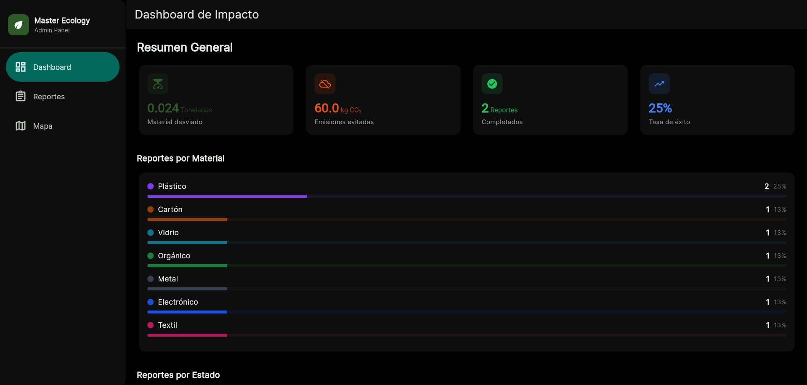

<div align="center">

# 🌿 Master Ecology

### Smart Recycling & Waste Management Platform

*Built for Hackathon v2.0 — Universidad Católica Luis Amigó*

[](https://flutter.dev)
[](https://dart.dev)
[](https://aws.amazon.com)
[](https://www.openstreetmap.org)
[](LICENSE)

**Mobile · Web · Cloud — all in one Flutter app**

</div>

---

## The Problem

Medellín generates thousands of tons of waste daily. Illegal dump sites appear overnight. Recyclable materials end up in landfills simply because no one connected the person who has them with the person who needs them.

Existing solutions focus on the city's perspective — maps for authorities, reports for planners. **Nobody built something for the recyclers themselves**: the people on the street, moving on bicycles or carts, who recover materials by hand every single day.

**Master Ecology bridges that gap.**

---

## What It Does

Three distinct experiences inside one application, each role seeing only what matters to them:

| Role | What they do |
|------|-------------|
| 🧍 **Citizen** | Report illegal garbage points, upload photo evidence, request recyclable pickups by material type |
| ♻️ **Recycler** | Receive nearby pickup requests, follow optimized collection routes, update job status in real time |
| 🏛️ **Admin / Authority** | Monitor citywide waste activity, read pollution heatmaps, access impact metrics for data-driven decisions |

---

## Screenshots

<table>
  <tr>
    <td align="center"><b>Welcome Screen</b></td>
    <td align="center"><b>Citizen Map</b></td>
  </tr>
  <tr>
    <td></td>
    <td></td>
  </tr>
  <tr>
    <td align="center"><b>Recycler Routes</b></td>
    <td align="center"><b>Admin Dashboard</b></td>
  </tr>
  <tr>
    <td></td>
    <td></td>
  </tr>
</table>

---

## Features

- 📱 **Cross-platform** — single codebase runs on Android, iOS, and the Web
- 🗺️ **Interactive maps** — real-time pins, route overlays, and pollution heatmaps over Medellín
- 📷 **Photo evidence** — citizens attach images to every report
- 🤖 **AI waste classification** — AWS Rekognition identifies material type from the photo automatically
- 📊 **Impact dashboard** — tons recovered, CO₂ avoided, active recyclers
- 🔔 **Route notifications** — recyclers are alerted when a nearby pickup is confirmed
- 🌗 **Adaptive layout** — bottom nav on mobile, navigation rail on desktop (≥ 720 px)
- 🎨 **Custom eco theme** — Forest Green `#2D5A27` + Technical Orange `#E8530A`

---

## Tech Stack

### Application

| Layer | Technology |
|-------|-----------|
| Framework | Flutter 3.x |
| Language | Dart |
| Architecture | Clean Architecture |
| State Management | Riverpod (StateNotifierProvider + FutureProvider) |
| Navigation | go_router — shell routes per role |
| Maps | flutter_map + OpenStreetMap (zero cost) |
| UI Theme | FlexColorScheme |

### Cloud (AWS)

| Service | Role in the app |
|---------|----------------|
| **AWS Amplify** | Hosting, CI/CD deployment, and cloud configuration |
| **AWS Lambda** | Serverless functions — report processing, route optimization, notifications |
| **Amazon DynamoDB** | Primary database — users, reports, routes, metrics |
| **Amazon S3** | Storage for citizen-uploaded waste photos |
| **Amazon Rekognition** | Computer vision — auto-classifies waste material from uploaded images |

---

## Architecture

```
lib/
├── main.dart
├── core/
│   ├── constants/app_constants.dart   # WasteMaterial, ReportType, ReportStatus, UserRole
│   ├── theme/app_theme.dart           # AppColors + AppTheme (light/dark)
│   └── router.dart                   # GoRouter with role-based redirect
├── models/
│   ├── report_model.dart              # Report + ReportLocation
│   └── user_model.dart               # AppUser
├── services/
│   └── mock_service.dart             # Singleton — seeded reports across Medellín
├── providers/
│   ├── auth_provider.dart            # AuthState + AuthNotifier
│   ├── reports_provider.dart         # ReportFilter + ReportsNotifier
│   └── metrics_provider.dart         # ImpactMetrics (tons, CO₂)
└── views/
    ├── shared/    # login, map, report_form, profile
    ├── citizen/   # citizen_shell
    ├── recycler/  # recycler_shell, recycler_routes_screen
    └── admin/     # admin_shell, admin_dashboard_screen, admin_reports_screen
```

---

## Getting Started

### Prerequisites

- Flutter SDK 3.x — [install guide](https://docs.flutter.dev/get-started/install)
- Dart SDK (bundled with Flutter)
- A modern browser (Chrome recommended for web dev)
- AWS credentials — required only for cloud features; the app runs with mock data without them

### Run locally

```bash
git clone https://github.com/Bramiya11/master-ecology-medellin.git
cd master-ecology
flutter pub get

# Web (recommended for development)
flutter run -d chrome --web-renderer canvaskit

# Mobile
flutter run -d <device-id>
```

### Build for production

```bash
flutter build web --release
```

The `build/web` output is deployed automatically via **AWS Amplify** on every push to `main`.

---

## Live demo

Demo already on the internet via Amplify!
https://dev.d2sqam9usg42ou.amplifyapp.com/#/login 

---

## Social Impact

Master Ecology is not only a software project — it is an argument that technology should serve the people who are hardest to see.

Recyclers in Colombia are informal workers who prevent tons of material from reaching landfills every day, without a contract, without a route planner, and often without recognition. This platform gives them a tool designed around how they actually work: mobile-first, map-driven, and connected to the citizens who need them.

Expected outcomes at scale:

- Reduction in illegal dump site persistence time
- Increase in material recovery rates in low-income neighborhoods
- Environmental intelligence data available to municipal authorities
- Formal visibility for informal recycler labor

---

## Author

**Brandon Ramirez Bedoya**
Backend · Frontend · Cloud Manager

[](https://github.com/Bramiya11)

---

## Contributing

Contributions are welcome. Open an issue to discuss what you'd like to change, then submit a pull request.

---

## License

Distributed under the MIT License. See [LICENSE](LICENSE) for details.

---

<div align="center">
  <sub>Built with 💚 in Medellín, Colombia · Hackathon v2.0 — Universidad Católica Luis Amigó</sub>
</div>
